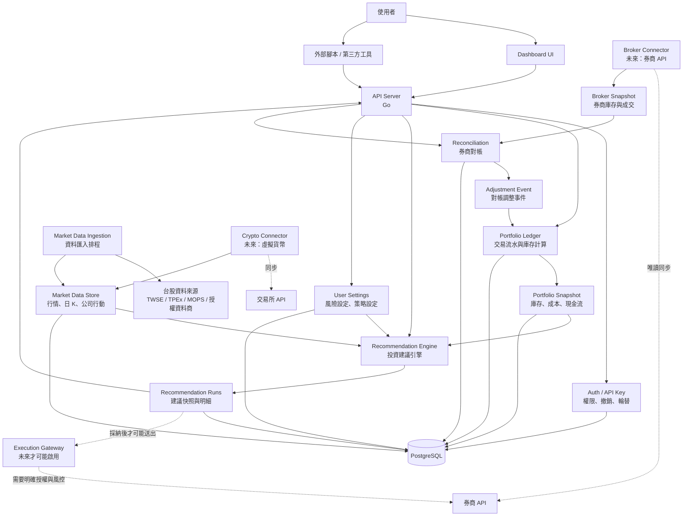
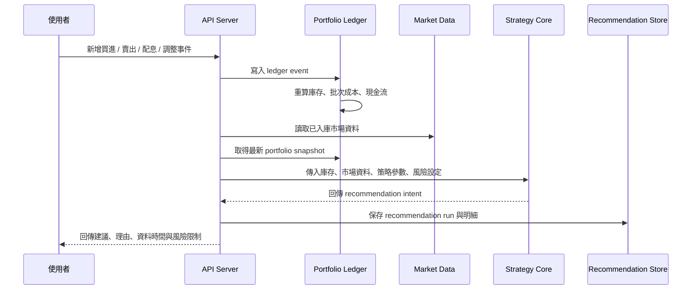
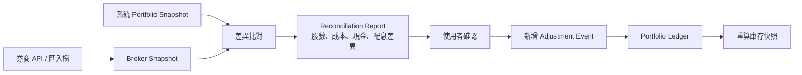

# 系統架構圖

這份圖表是目前文件整理後的架構版本。重點是：系統先做投資建議，不直接替使用者下單；庫存由交易流水推導；UI 與外部工具都走同一套 API。

## 系統總覽

## 建議產生流程

## 券商對帳流程

## 邊界確認

- UI 不直接碰資料庫，只呼叫 API。
- 庫存不是 CRUD 表，而是由 ledger event 算出來。
- 策略核心只做計算，不抓網路、不讀寫資料庫、不寫檔案。
- 市場資料先入庫，建議引擎只吃已整理好的資料。
- 券商 API 第一階段只做唯讀同步與對帳。
- 自動下單不在第一階段；未來若要做，會放在獨立 Execution Gateway，並要求明確授權、風控與審計。
